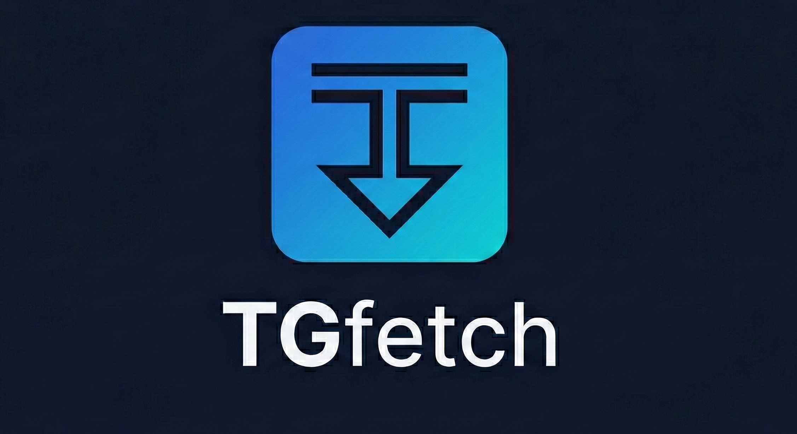

<p align="center">
  
</p>

<h1 align="center">TGfetch</h1>

<p align="center">
  <b>A premium, open-source Telegram media downloader for desktop.</b><br/>
  Browse your joined channels, preview media, and bulk-download files — all from a beautiful, modern interface.
</p>

<p align="center">
  <a href="https://github.com/LokiDevX/TGfetch/releases"></a>
  
  
  
  
  
</p>

---

## ✨ Features

| Feature | Description |
|---------|-------------|
| 🔐 **QR Code Login** | Scan a QR code with your Telegram mobile app — no typing required |
| 📞 **Phone Login** | Fallback phone + OTP + 2FA flow for any account |
| 📡 **Channel Browser** | Automatically lists every channel & supergroup you've joined |
| 🖼️ **Media Gallery** | Grid or list view with type filters (video, photo, document, audio) |
| ⬇️ **Bulk Download** | Select multiple files and download them concurrently (5 parallel) |
| 📊 **Real-time Progress** | Per-file progress bars, speed, ETA, and toast notifications |
| 🔄 **Session Persistence** | Log in once — your session auto-restores on every launch |
| 🎨 **Premium UI** | Glassmorphism, gradient accents, Framer Motion animations, dark theme |
| 🛡️ **Secure by Design** | API credentials isolated in the main process; context isolation enforced |
| 📜 **Download History** | Track every download session with metadata |

---

## 📸 Screenshots

> _Coming soon — run the app locally to experience the full UI._

---

## 🚀 Quick Start

### Prerequisites

| Requirement | Version |
|-------------|---------|
| **Node.js** | 18 + |
| **npm** | 9 + |
| **Git** | any |
| **Telegram API Credentials** | from [my.telegram.org/apps](https://my.telegram.org/apps) |

### 1 · Clone the repository

```bash
git clone https://github.com/LokiDevX/TGfetch.git
cd TGfetch
```

### 2 · Install dependencies

```bash
npm install
```

### 3 · Configure API credentials

Copy the example environment file and fill in your Telegram API credentials:

```bash
cp .env.example .env
```

Then edit `.env` with your values:

```env
TG_API_ID=your_api_id
TG_API_HASH=your_api_hash
```

> **How to get these?** Visit [my.telegram.org/apps](https://my.telegram.org/apps), log in, and create an application. You'll receive an **API ID** (numeric) and an **API Hash** (32-char hex string).

### 4 · Run in development mode

```bash
npm run dev
```

This starts both the Vite dev server and the Electron app concurrently.

---

## 🏗️ Building for Production

```bash
# Compile TypeScript + bundle frontend
npm run build

# Package for Windows (.exe installer)
npm run build:win

# Package for Linux (.AppImage)
npm run build:linux
```

Built artifacts are placed in the `release/` directory.

---

## 🎯 How to Use

### Step 1 — Authenticate

Choose your preferred login method:

- **QR Login** _(recommended)_ — Click **Login with QR**, then scan the code from **Telegram → Settings → Devices → Link Desktop Device**.
- **Phone Login** — Click **Use Phone Number**, enter your number with country code, submit the OTP from Telegram, and (if enabled) your 2FA password.

Once authenticated, your session is saved locally. On next launch you'll be auto-connected.

### Step 2 — Browse Channels

Navigate to **My Channels** in the sidebar. TGfetch loads all your joined channels and supergroups, showing name, username, public/private badge, and member count.

### Step 3 — Explore Media

Click any channel to enter the **Media Browser**. Use the toolbar to:

- Toggle between **Grid** and **List** view
- Filter by media type: **All · Video · Photo · Document · Audio**

### Step 4 — Download

- **Single file** — Hover a media card and click the download button.
- **Bulk download** — Select files with checkboxes (or **Select All**), then hit **Download (n)**. Files are downloaded 5 at a time with real-time progress tracking.

---

## 🗂️ Project Structure

```
TGfetch/
├── electron/                    # Electron main + preload process
│   ├── main.ts                  # App entry, IPC handlers, auth state machine
│   ├── preload.ts               # Context bridge (renderer ↔ main)
│   └── services/
│       ├── telegramService.ts   # Auth, QR login, client management
│       ├── channelService.ts    # Channel listing, media fetching
│       └── downloadManager.ts   # Concurrent download orchestration
│
├── src/                         # React renderer (Vite)
│   ├── App.tsx                  # Root layout, page routing, overlay dialogs
│   ├── main.tsx                 # React DOM entry
│   ├── index.css                # Global styles
│   ├── components/
│   │   ├── AuthDialog.tsx       # QR + phone login modal
│   │   ├── Sidebar.tsx          # Collapsible navigation sidebar
│   │   ├── Navbar.tsx           # Top navigation bar
│   │   ├── ActivityLog.tsx      # Real-time download activity panel
│   │   ├── ProgressBar.tsx      # Download progress indicator
│   │   ├── SplashScreen.tsx     # Animated startup splash
│   │   ├── ApiSetupScreen.tsx   # First-run API credential setup
│   │   ├── FolderSelector.tsx   # Download path picker
│   │   ├── InputField.tsx       # Reusable input component
│   │   └── DownloadSummary.tsx  # Post-download summary card
│   ├── pages/
│   │   ├── Dashboard.tsx        # Home — stats, quick actions, recent downloads
│   │   ├── Channels.tsx         # Joined channel browser grid
│   │   ├── Media.tsx            # Media gallery with filters & bulk select
│   │   ├── History.tsx          # Download history log
│   │   └── Settings.tsx         # App preferences
│   ├── store/
│   │   └── downloadStore.ts     # Zustand global state
│   └── types/
│       └── global.d.ts          # Shared TypeScript interfaces & IPC types
│
├── assets/                      # Project images (banner, etc.)
├── scripts/                     # Development utility scripts
├── public/                      # Static assets (icon)
├── build/                       # Build resources (icon.ico, icon.png)
├── .env.example                 # API credential template (copy to .env)
├── tailwind.config.js           # TailwindCSS theme customisation
├── vite.config.ts               # Vite + Electron plugin config
├── tsconfig.json                # TypeScript config (renderer)
├── tsconfig.electron.json       # TypeScript config (main process)
└── package.json
```

---

## 🧰 Tech Stack

| Layer | Technology |
|-------|-----------|
| **Desktop Shell** | [Electron 29](https://www.electronjs.org/) |
| **Frontend** | [React 18](https://react.dev/) + [TypeScript](https://www.typescriptlang.org/) (strict) |
| **Build Tool** | [Vite 5](https://vitejs.dev/) + `vite-plugin-electron` |
| **Styling** | [TailwindCSS 3](https://tailwindcss.com/) with custom dark theme |
| **State Management** | [Zustand 4](https://zustand-demo.pmnd.rs/) with persistence middleware |
| **Animations** | [Framer Motion 11](https://www.framer.com/motion/) |
| **Icons** | [Lucide React](https://lucide.dev/) |
| **Notifications** | [react-hot-toast](https://react-hot-toast.com/) |
| **Telegram Client** | [GramJS](https://gram.js.org/) (`telegram` npm package) |
| **QR Generation** | [qrcode](https://www.npmjs.com/package/qrcode) |
| **Packaging** | [electron-builder](https://www.electron.build/) |

---

## 🔐 Security

TGfetch is designed with a **security-first** architecture:

- **API credentials** (`API_ID` / `API_HASH`) are loaded in the **main process only** and are **never** exposed to the renderer.
- **Context isolation** is enabled; `nodeIntegration` is disabled.
- All renderer ↔ main communication goes through a **typed IPC bridge** (`contextBridge`).
- **Sessions** are stored as encrypted `StringSession` objects in the platform-specific user data directory:
  - Windows: `%APPDATA%/tgfetch/session.json`
  - Linux: `~/.config/tgfetch/session.json`
  - macOS: `~/Library/Application Support/tgfetch/session.json`
- Passwords and QR tokens are **never** persisted to disk.

---

## 🔄 Authentication Flow

```
App Launch
    │
    ▼
Session file exists?
    ├── YES ──► Restore & validate (getMe) ──► ✅ Authenticated
    │                                       └─► ❌ Invalid → delete session → Idle
    └── NO ───► Show "Connect Telegram"
                    │
                    ├── QR Login ──► Scan from mobile ──► ✅ Authenticated
                    └── Phone Login
                          │
                          ▼
                    Enter phone → OTP → (2FA password) → ✅ Authenticated
                                                           │
                                                           ▼
                                                     Save session.json
```

---

## 📡 IPC API Reference

All methods are available in the renderer via `window.tgfetch.auth`:

| Method | Direction | Description |
|--------|-----------|-------------|
| `auth.getStatus()` | Renderer → Main | Returns current `{ status, phoneNumber?, error? }` |
| `auth.hasSession()` | Renderer → Main | `boolean` — whether a saved session exists |
| `auth.hasCredentials()` | Renderer → Main | `boolean` — whether API credentials are configured |
| `auth.restoreSession()` | Renderer → Main | Attempt to auto-restore and validate session |
| `auth.connect()` | Renderer → Main | Initiate a new Telegram connection |
| `auth.submitPhone(phone)` | Renderer → Main | Submit phone number during login |
| `auth.submitCode(code)` | Renderer → Main | Submit OTP verification code |
| `auth.submitPassword(pwd)` | Renderer → Main | Submit 2FA password |
| `auth.logout()` | Renderer → Main | Disconnect and delete session |
| `auth.onStatusChange(cb)` | Main → Renderer | Subscribe to real-time auth status events |

---

## ⚡ Performance

| Metric | Value |
|--------|-------|
| Cold start (no session) | < 500 ms |
| Session restore | 1–2 s |
| Parallel downloads | 5 concurrent |
| Memory baseline | ~15 MB |
| Memory during downloads | +50–100 MB |
| Renderer bundle size | ~352 KB |

Telegram rate limits (flood control) are handled automatically with retry & back-off.

---

## 📋 Available Scripts

| Script | Description |
|--------|-------------|
| `npm run dev` | Start Vite dev server + Electron in development mode |
| `npm run build` | Compile TypeScript & bundle the frontend |
| `npm run build:win` | Build + package Windows `.exe` installer (NSIS) |
| `npm run build:linux` | Build + package Linux `.AppImage` |
| `npm run preview` | Preview the Vite production build |
| `npm run typecheck` | Run TypeScript type-checking (no emit) |

---

## 🐛 Known Limitations

- **Thumbnails**: Media cards show type icons instead of actual thumbnails.
- **Photo sizes**: Displayed as "0 B" due to a Telegram API limitation.
- **Pagination**: Fetches up to ~200 media items per channel (infinite scroll planned).
- **Search**: Media search bar is not yet functional.
- **Keyboard shortcuts**: Not yet implemented.

---

## 🗺️ Roadmap

- [ ] Infinite scroll for large channels
- [ ] Media search by filename
- [ ] Thumbnail generation / preview
- [ ] Download queue management (pause / resume)
- [ ] Background downloads
- [ ] Export download history to CSV
- [ ] Keyboard shortcuts
- [ ] Drag & drop download
- [ ] Multi-account support
- [ ] Session encryption via `safeStorage`

---

## 🤝 Contributing

Contributions are welcome! Here's how to get started:

1. **Fork** the repository
2. **Create** a feature branch: `git checkout -b feat/my-feature`
3. **Commit** your changes: `git commit -m "feat: add my feature"`
4. **Push** to the branch: `git push origin feat/my-feature`
5. **Open** a Pull Request

### Guidelines

- Use **strict TypeScript** — no `any` types.
- Keep Telegram / business logic in the **main process**.
- Use **Zustand** for shared state; avoid prop-drilling.
- Never log or expose API credentials or session strings.
- Add toast notifications for user-facing feedback.
- Test auth, download, and session-restore flows before submitting.

---

## 📄 License

This project is open-source and available under the [MIT License](LICENSE).

---

## 👤 Author

**Lokesh Navale**

- GitHub: [@LokiDevX](https://github.com/LokiDevX)
- LinkedIn: [Lokesh Navale](https://www.linkedin.com/in/lokesh-navale/)

---

<p align="center">
  Made with ❤️ by <a href="https://github.com/LokiDevX">Loki</a><br/>
  <sub>If you find TGfetch useful, consider giving the repo a ⭐</sub>
</p>
